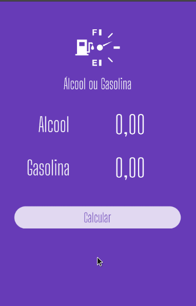

# AlcoolouGasolina7192

Projeto Criado no Curso 7192 do balta.io.

## Resumo

Nesse projeto criamos um app que faz o calculo da melhor opção, Álcool ou Gasolina.

##Aprendizados mais importantes:

- Componentização
- Uso do Theme para gerenciar melhor as cores
- Uso de Animated Container
- Uso da LIB flutter_masked_text (MoneyMasked)
- Passagem de Informações para Widgets
- ETC

# Layout

