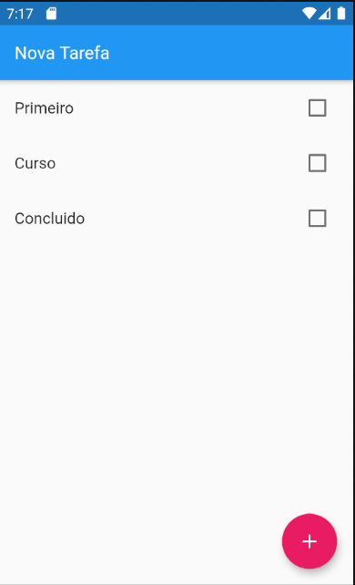
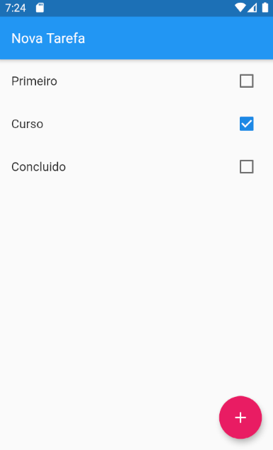
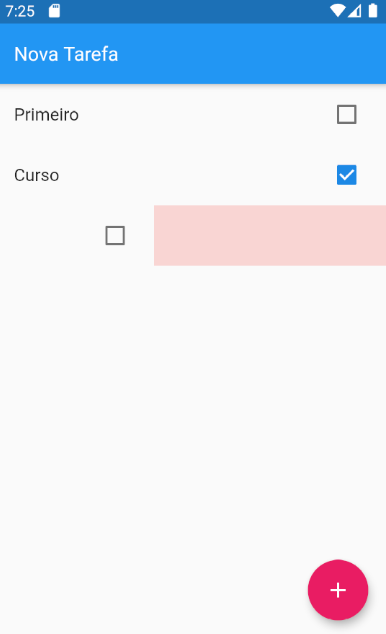

# ToDo_7184

Projeto Criado no Curso 7184 do balta.io.

## Resumo

Nesse projeto criamos um aplicativo de To Do com save e delete usando SharedPreferences.

# Layout

<table border="1" cellspacing="0" rules="none">
  <tr>
    <td></td>
    <td></td>
  </tr>
  <tr>
    <td></td>
  </tr>
</table>

